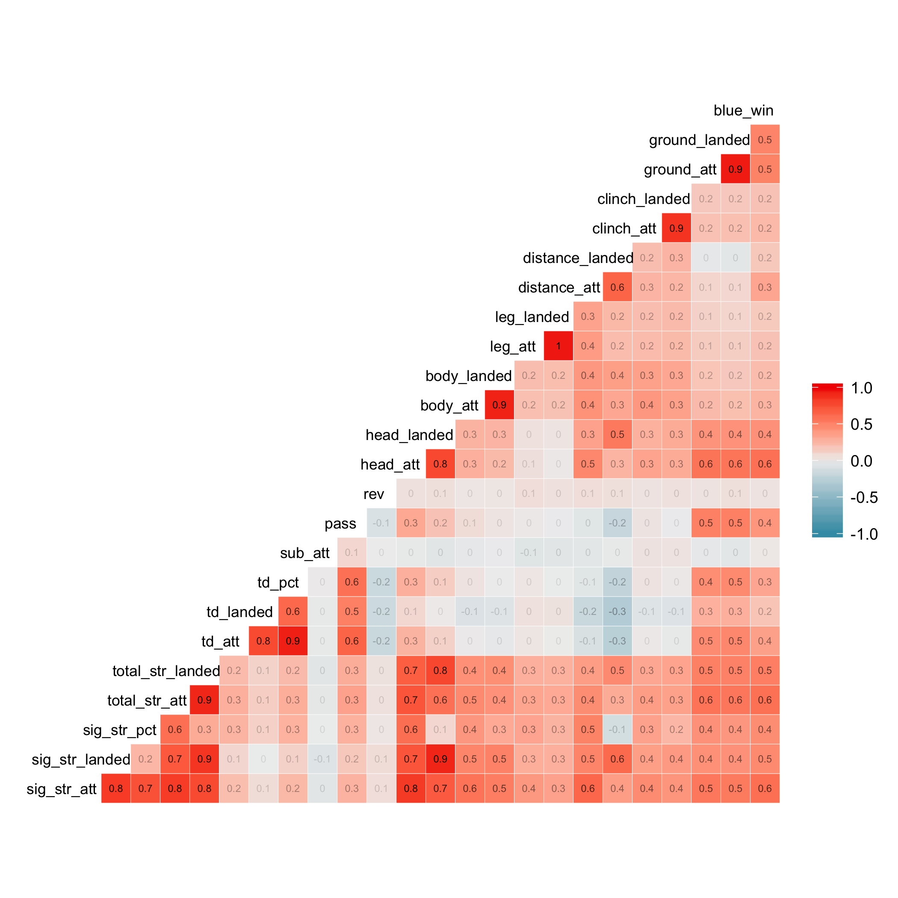
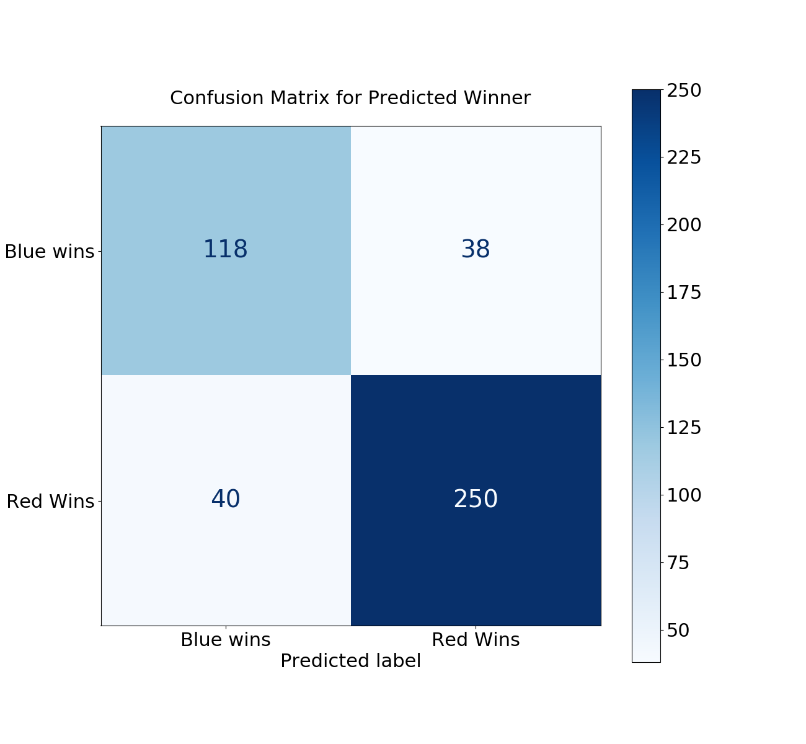

```{r setup, include=FALSE}
knitr::opts_chunk$set(echo = FALSE)
library(knitr)
library(kableExtra)
library(tidyverse)

```

```{r load, echo=FALSE, message=FALSE, out.width = '40%'}
table1 <- read_csv("../analysis/weights.csv")
table2 <- read_csv("../analysis/results.csv")
```

## Summary

In this study, we aim to assess whether the judging in the Ultimate Fighting Championship (UFC) is consistent with the official rules and guidance. To answer this question, we need to identify the key predictors for winning determined by the judges based on the performance and evaluate whether these predictors are consistent with the priorities of round assessments according to the official rules. We built a regression model using the logistic regression algorithm to assign weights to the features and used recursive feature elimination (RFE) approach to identify the strong predictors. Among the selected `r nrow(table1)` features by RFE, 7 features are related to Striking/Grappling performance which should be considered as the top factor in judgment based on the UFC official rules. Our final logistic regression model using these selected features performed well on validation data set with accuracy score of `r round(table2$Score[4],2)`. It correctly predicted 368 out of 446 test cases and incorrectly predicted 78 cases with 40 being false positive and 38 false negative. Our results showed that the judges generally comply to the UFC rules and put weights on some additional factors.


## Introduction

The Ultimate Fighting Championship (UFC) is the world's premier mixed martial arts (MMA) organization. The events are to identify the world's best martial artists. Since it is a relatively new sport, the rules are not well established and need improvement. The results of the fights are often controversy when the winning is needed to be decided by judges based on the competitors' performance (instead of ending by submission or technical knockout). The official rules provide general guidance in judging the winner. The criteria sets priority from high to low ranking effective Striking/Grappling, effective Striking/Grappling and cage/ring Control[@MMA-judging-criteria]. As more and more controversy of the judging decisions raised, a systematic analysis of the UFC data would be very informative to evaluate the overall quality of UFC judging system.

In this project, we are trying to identify the key predictors for winning in previous UFC events and examine whether these key predictors are in line with the UFC official guidance. This analysis is very significant because it may serve as a quanlity control approach for the UFC judging system and help to improve the rules and training strategies for the judges in the future.
 

## Methods

### Data
The original data was obtained from Kaggle user Rajeev Warrier [@UFC-dataset]. The data has also been downloaded and uploaded to a [GitHub repo](https://github.com/SamEdwardes/ufc-data) to avoid issues for users who do not have Kaggle accounts. Each row in the dataset represents statistics from an UFC event, including the performance features and winners (Red or Blue). The data was pre-processed by only selecting the features related to fight performance and for the each feature, the ratio of Blue fighter versus the Red fighter was calculated. The target was computed as whether the Blue fighter wins or not. 

### Analysis
The logistic regression algorithm was used to build a regression model to assign weights to all the features in the pre-processed data. The features included in the final model were selected using recursive feature elimination (RFE) approach with cross validation. A final regression model was built using these selected features and used to predict on the validation data set. The R and Python programming languages [@R; @Python] and the following R and Python packages were used to perform the analysis: docopt [@docopt], janitor [@janitor], tidyverse [@tidyverse], GGally [@GGally], docopt [@docoptpython], os [@Python], requests [@requests], Pandas [@mckinney-proc-scipy-2010], numpy [@NumPy], altair [@Altair2018], matplotlib [@Hunter:2007], selenium [@selenium], scikit-learn [@sklearn_api], chromedriver-binary [@chromedriver-binary]. The scripts for generating the analysis and the report together with all the relevant information can be found [here](https://github.com/UBC-MDS/DSCI522_group315). 


## Results & Discussion

To explore the relationships between different features and between features and target, we plotted the pair-wise correlation matrix (Figure 1). The graph showed that features sig_str_att, head_att, total_str_att are highly correlated with the target. It also indicated there are some interaction between the features.

```{r pair-wise, echo=FALSE, fig.cap="Figure 1. Correlation matrix for features and target.", out.width = '50%', fig.align="center"}

```


We categorized the features into four groups and in each group we explored the relationships between features and target (Figure 2). In general, the results showed that all the distributions of features between winning and losing were overlapped for some extend in different groups. However, each group has some features with significant difference in the means, which indicating these features may be strong predictors for the target. The result is consistent with the feature-target correlation analysis. 

```{r strike, echo=FALSE, fig.cap="Figure 2. Comparison of the distributions of the predictors between winning and losing in different groups. Top left: striking features, top right: ground features, bottom left: attacks-to features, bottom right: attacks-from features.", out.width = '40%',out.width = '50%', fig.show='hold'}
knitr::include_graphics(c("../analysis/figures/fig_eda_02_striking_features_relationship.png", "../analysis/figures/fig_eda_03_ground_features_relationship.png"))
knitr::include_graphics(c("../analysis/figures/fig_eda_04_attacks_to_features_relationship.png","../analysis/figures/fig_eda_05_attacks_from_features_relationship.png"))

```

<p>&nbsp;</p>

We chose logistic regression model to assign weights to all the features and used recursive feature elimination (RFE) with cross validation approach to identify the most relevant features and ranked them according to the weights (Table 1). Features with higher weights are stronger predictors for winning. Among the 11 features, the top feature and another 6 features are indicators of Striking/Grappling performance, which should be the first priority in judging criteria according to the UFC official rules [@MMA-judging-criteria].This indicates the rules were generally followed by the judges. Four features do not belong to the Striking/Grappling group, such as the top second feature "head_att", suggesting there are some other factors which the judges put higher weights on.


```{r RFE weights, echo=FALSE, message=FALSE}
table1 <- read_csv("../analysis/weights.csv")
kable(table1, align = "cc", caption = "Table 1. REF selected features and their weights.") %>%
  kable_styling("striped", position="center", full_width = FALSE) 
```
*Note: The features' full name and explanation can be found [here](https://www.kaggle.com/rajeevw/ufcdata).*

To validate our feature selection, we calculate the train and test errors using recursive feature elimination (RFE) with the "n_features_to_select" hyperprameter ranging from 1 to 22 (Figure 3). It is observed that when the "n_features_to_select" hyperprameter is between 8 and 11,  the train and validation errors are relatively small, confirming the results from RFE with cross validation.


```{r choosing-features, echo=FALSE, fig.cap="Figure 3. The train and validation error for including different numbers of features in the model .", out.width = '60%', fig.align="center"}
knitr::include_graphics("../analysis/figures/error.png")
```


We built our final logistic regression model using the 11 features selected by RFE with cross validation and compared it with a logistic regression model using all the features. The accuracy on the train and validation data sets are reasonable for both models. The accuracy for the model with feature selection is slightly better than the model without feature selection. 

```{r RFE error, echo=FALSE, message=FALSE, out.width = '40%'}
table2 <- read_csv("../analysis/results.csv")
kable(table2, align = "cc", caption = "Table 2. Accuray of model performance on train and validation data sets.") %>%
  kable_styling("striped", position="center", full_width = FALSE) 
```


The confusion matrix showed similar accuracy, where our model correctly predicted 368 out of 446 validation cases and incorrectly predicted 78 cases with 40 being false positive and 38 false negative cases (Figure 4). 

```{r confusion-matrix, echo=FALSE, fig.cap="Figure 4. Confusion matrix of model performance on test data on validation data set.", out.width = '60%', fig.align="center"}

```

Overall, we identified the key predictors for UFC winning. Most of these strong predictors are indicators of Strking/Grappling performance, which is consistent with the top criteria in UFC judgment. However, several other predictors are also heavily weighted by the judges. Although our model performed well on the validation data set, there is still room to improve and optimize the model to achieve better accuracy. However, the results may also reflect the inherent heterogeneity with the data set, suggesting there are big variations in the subjective judgement on different cases. 
 
 
## References