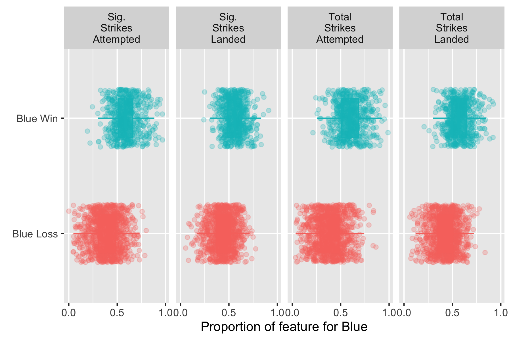
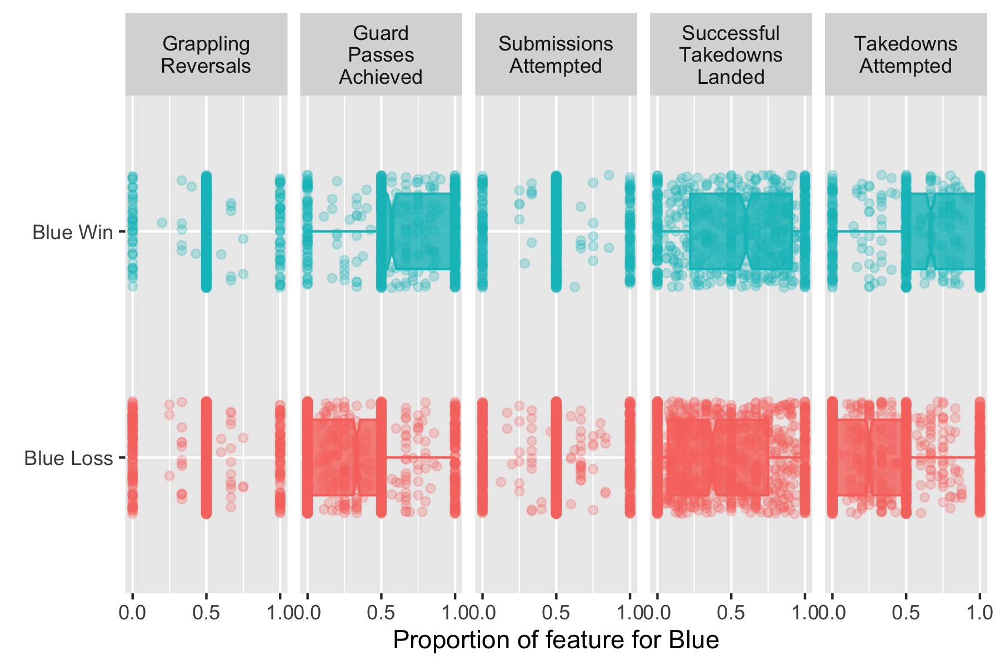
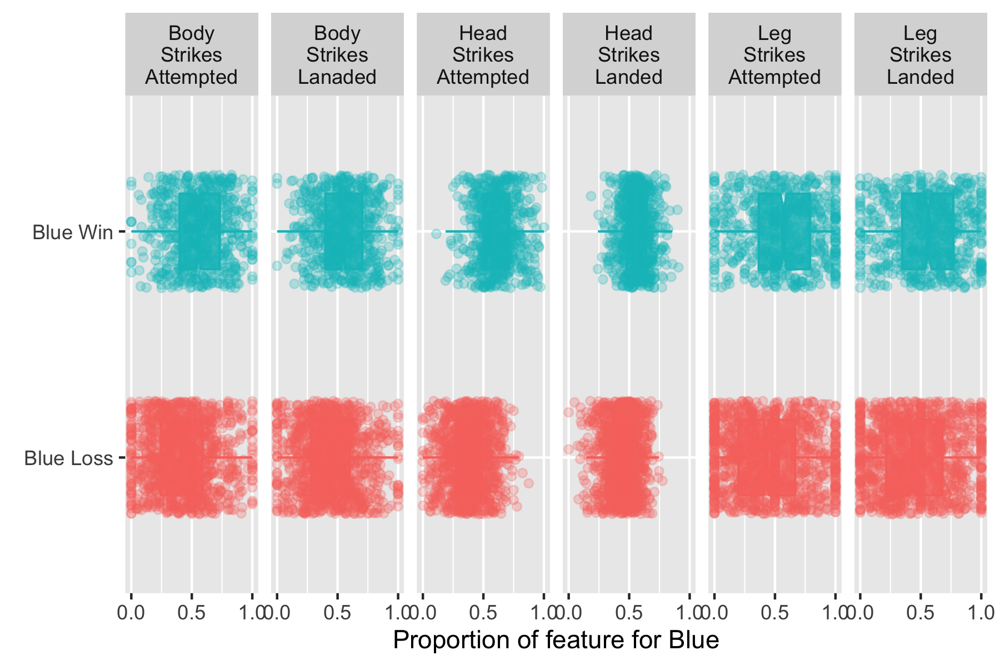
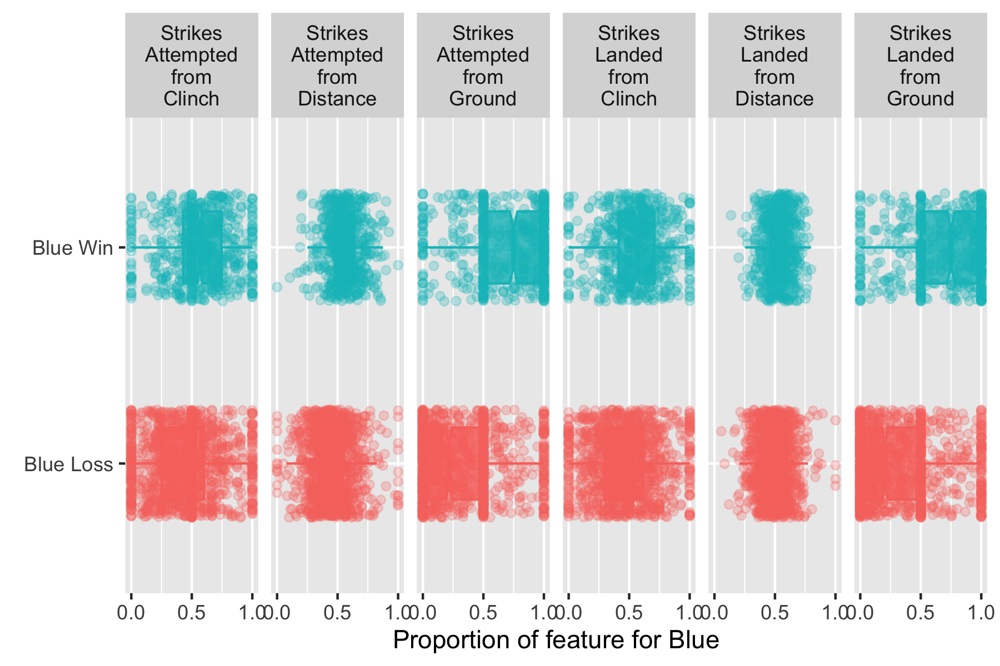

UFC Judge Scoring Analysis
================
DSCI 522 group 315  
2020-01-23 (updated: 2020-02-01)

## Summary

In this study, we aim to assess whether the judging in the Ultimate
Fighting Championship (UFC) is consistent with the official rules and
guidance. To answer this question, we need to identify the key
predictors for winning determined by the judges based on the performance
and evaluate whether these predictors are consistent with the priorities
of round assessments according to the official rules. We built a
regression model using the logistic regression algorithm to assign
weights to the features and used recursive feature elimination (RFE)
approach to identify the strong predictors. Among the selected 11
features by RFE, 7 features are related to Striking/Grappling
performance which should be considered as the top factor in judgment
based on the UFC official rules. Our final logistic regression model
using these selected features performed well on validation data set with
accuracy score of 0.83. It correctly predicted 368 out of 446 test cases
and incorrectly predicted 78 cases with 40 being false positive and 38
false negative. Our results showed that the judges generally comply to
the UFC rules and put weights on some additional factors.

## Introduction

The Ultimate Fighting Championship (UFC) is the world’s premier mixed
martial arts (MMA) organization. The events are to identify the world’s
best martial artists. Since it is a relatively new sport, the rules are
not well established and need improvement. The results of the fights are
often controversy when the winning is needed to be decided by judges
based on the competitors’ performance (instead of ending by submission
or technical knockout). The official rules provide general guidance in
judging the winner. The criteria sets priority from high to low ranking
effective Striking/Grappling, effective Striking/Grappling and cage/ring
Control(The ABC MMA Rules Committee 2017). As more and more controversy
of the judging decisions raised, a systematic analysis of the UFC data
would be very informative to evaluate the overall quality of UFC judging
system.

In this project, we are trying to identify the key predictors for
winning in previous UFC events and examine whether these key predictors
are in line with the UFC official guidance. This analysis is very
significant because it may serve as a quality control approach for the
UFC judging system and help to improve the rules and training strategies
for the judges in the future.

## Methods

### Data

The original data was obtained from Kaggle user Rajeev Warrier (Rajeev
Warrier 2019). The data has also been downloaded and uploaded to a
[GitHub repo](https://github.com/SamEdwardes/ufc-data) to avoid issues
for users who do not have Kaggle accounts. Each row in the dataset
represents statistics from an UFC event, including the performance
features and winners (Red or Blue). The data was pre-processed by only
selecting the features related to fight performance and for the each
feature, the ratio of Blue fighter versus the Red fighter was
calculated. The target was computed as whether the Blue fighter wins or
not.

The table below explains each feature that was considered as part of the
analysis:

| Feature Name Short | Description                                             | Category     |
| ------------------ | ------------------------------------------------------- | ------------ |
| blue\_win          | 1 if the blue fighter won, 0 if the red fighter 1       | Win/lose     |
| ground\_land       | Number of strikes landed while on the ground            | Strikes from |
| ground\_att        | Number of strikes attempted while on the ground         | Strikes from |
| clinch\_landed     | Number of strikes landed while in the clinch            | Strikes from |
| clinch\_att        | Number of strikes attempted while in the clinch         | Strikes from |
| distance\_landed   | Number of strikes landed from a distance                | Strikes from |
| distance\_att      | Number of strikes attempted from a distance             | Strikes from |
| leg\_landed        | Number of strikes to opponents leg landed               | Strikes to   |
| leg\_att           | Number of strikes to opponents leg attempted            | Strikes to   |
| body\_landed       | Number of strikes to opponents body landed              | Strikes to   |
| body\_att          | Number of strikes to opponents body attempted           | Strikes to   |
| head\_landed       | Number of strikes to opponents head landed              | Strikes to   |
| head\_att          | Number of strikes to opponents head landed              | Strikes to   |
| rev                | Number of grappling reversals achieved                  | Grappling    |
| pass               | Number of guard passes achieved                         | Grappling    |
| sub\_att           | Number of submission attempts on opponent               | Grappling    |
| td\_pct            | Percent of takedowns successfully completed on opponent | Grappling    |
| td\_landed         | Number of takedowns successfully completed on opponent  | Grappling    |
| td\_att            | Number of takedowns attempted on opponent               | Grappling    |
| total\_str\_landed | Total strikes landed on opponent                        | Striking     |
| total\_str\_att    | Total strikes attempted on opponent                     | Striking     |
| sig\_str\_att      | Total significant strikes attempted on opponent         | Striking     |
| sig\_str\_pct      | Percent of significant strikes landed on opponent       | Striking     |
| sig\_str\_landed   | Total significant strikes landed on opponent            | Striking     |

### Analysis

The logistic regression algorithm was used to build a regression model
to assign weights to all the features in the pre-processed data. The
features included in the final model were selected using recursive
feature elimination (RFE) approach with cross validation. A final
regression model was built using these selected features and used to
predict on the validation data set. The R and Python programming
languages (R Core Team 2019; Van Rossum and Drake 2009) and the
following R and Python packages were used to perform the analysis:
docopt (de Jonge 2018), janitor (Sam Firke 2020), tidyverse (Wickham
2017), GGally (al 2018), docopt (Keleshev 2014), os (Van Rossum and
Drake 2009), requests (Reitz 2019), Pandas (McKinney 2010), numpy
(Oliphant 2006), altair (VanderPlas et al. 2018), matplotlib (Hunter
2007), selenium (Muthukadan 2019), scikit-learn (Buitinck et al. 2013),
chromedriver-binary (Kaiser 2019). The scripts for generating the
analysis and the report together with all the relevant information can
be found [here](https://github.com/UBC-MDS/DSCI522_group315).

## Results & Discussion

To explore the relationships between different features and between
features and target, we plotted the pair-wise correlation matrix (Figure
1). The graph showed that features sig\_str\_att, head\_att,
total\_str\_att are highly correlated with the target. It also indicated
there are some interaction between the
features.

Figure 1. Correlation matrix for features and target.

We categorized the features into four groups and in each group we
explored the relationships between features and target (Figure 2). In
general, the results showed that all the distributions of features
between winning and losing were overlapped for some extend in different
groups. However, each group has some features with significant
difference in the means, which indicating these features may be strong
predictors for the target. The result is consistent with the
feature-target correlation
analysis.

Figure 2. Comparison of the distributions of the predictors between
winning and losing in different groups. From top to bottom: striking
features, ground features, attacks-to features, attacks-from
features.The feature explanations can be found in method section.

 

We chose logistic regression model to assign weights to all the features
and used recursive feature elimination (RFE) with cross validation
approach to identify the most relevant features and ranked them
according to the weights (Table 1). Features with higher weights are
stronger predictors for winning. Among the 11 features, the top feature
and another 6 features are indicators of Striking/Grappling performance,
which should be the first priority in judging criteria according to the
UFC official rules (The ABC MMA Rules Committee 2017).This indicates the
rules were generally followed by the judges. Four features do not belong
to the Striking/Grappling group, such as the top second feature
“head\_att”. Further information are needed to evaluate whether the
four features belong to the ffective Striking/Grappling and cage/ring
Control. Without further information, it may suggest these are some
additional factors which the judges put higher weights
on.

<table class="table table-striped" style="width: auto !important; margin-left: auto; margin-right: auto;">

<caption>

Table 1. REF selected features and their weights.

</caption>

<thead>

<tr>

<th style="text-align:center;">

Features

</th>

<th style="text-align:center;">

Weights

</th>

</tr>

</thead>

<tbody>

<tr>

<td style="text-align:center;">

sig\_str\_att

</td>

<td style="text-align:center;">

\-3.429

</td>

</tr>

<tr>

<td style="text-align:center;">

head\_att

</td>

<td style="text-align:center;">

\-3.224

</td>

</tr>

<tr>

<td style="text-align:center;">

total\_str\_att

</td>

<td style="text-align:center;">

\-2.897

</td>

</tr>

<tr>

<td style="text-align:center;">

td\_att

</td>

<td style="text-align:center;">

\-2.342

</td>

</tr>

<tr>

<td style="text-align:center;">

distance\_att

</td>

<td style="text-align:center;">

\-1.489

</td>

</tr>

<tr>

<td style="text-align:center;">

distance\_landed

</td>

<td style="text-align:center;">

1.346

</td>

</tr>

<tr>

<td style="text-align:center;">

pass

</td>

<td style="text-align:center;">

\-1.263

</td>

</tr>

<tr>

<td style="text-align:center;">

total\_str\_landed

</td>

<td style="text-align:center;">

\-1.125

</td>

</tr>

<tr>

<td style="text-align:center;">

td\_pct

</td>

<td style="text-align:center;">

1.113

</td>

</tr>

<tr>

<td style="text-align:center;">

td\_landed

</td>

<td style="text-align:center;">

0.716

</td>

</tr>

<tr>

<td style="text-align:center;">

ground\_att

</td>

<td style="text-align:center;">

\-0.673

</td>

</tr>

</tbody>

</table>

*Note: The feature full name and explanation can be found in Method
section.*

To visulize how feature selection affects the model performance, we
calculate the train and test errors using recursive feature elimination
(RFE) with the “n\_features\_to\_select” hyperprameter ranging from 1 to
22 (Figure 3). It is observed that when the “n\_features\_to\_select”
hyperprameter is 5 to 8, the train and validation errors are relatively
small and have balanced bias-variance trade-off. This is not quite
consistent with the number of features we got from the RFE with cross
validation. However, it is not suprising that the cross validation can
help to better optimize the hyperparameters while manually chosing the
hyperarameters may subject to
variations.

Figure 3. The train and validation error for including different numbers
of features in the model .

We built our final logistic regression model using the 11 features
selected by RFE with cross validation and compared it with a logistic
regression model using all the features. The accuracy on the train and
validation data sets are reasonable for both models. The accuracy for
the model with feature selection is slightly better than the model
without feature
selection.

<table class="table table-striped" style="width: auto !important; margin-left: auto; margin-right: auto;">

<caption>

Table 2. Accuracy of model performance on train and validation data
sets.

</caption>

<thead>

<tr>

<th style="text-align:center;">

Model

</th>

<th style="text-align:center;">

Score

</th>

</tr>

</thead>

<tbody>

<tr>

<td style="text-align:center;">

Training Accuracy - No Feature Selection

</td>

<td style="text-align:center;">

0.843

</td>

</tr>

<tr>

<td style="text-align:center;">

Testing Accuracy - No Feature Selection

</td>

<td style="text-align:center;">

0.821

</td>

</tr>

<tr>

<td style="text-align:center;">

Training Accuracy - Selected Features

</td>

<td style="text-align:center;">

0.846

</td>

</tr>

<tr>

<td style="text-align:center;">

Testing Accuracy - Selected Features

</td>

<td style="text-align:center;">

0.825

</td>

</tr>

</tbody>

</table>

The confusion matrix showed similar accuracy, where our model correctly
predicted 368 out of 446 validation cases and incorrectly predicted 78
cases with 40 being false positive and 38 false negative cases (Figure
4).

Figure 4. Confusion matrix of model performance on test data on
validation data set.

Overall, we identified the key predictors for UFC winning. Most of these
strong predictors are indicators of Striking/Grappling performance,
which is consistent with the top criteria in UFC judgment. However,
several other predictors are also heavily weighted by the judges.
Although our model performed well on the validation data set, there is
still room to improve and optimize the model to achieve better accuracy.
However, the results may also reflect the inherent heterogeneity with
the data set, suggesting there are big variations in the subjective
judgement on different cases. Further areas to explore in optimizing the
model are trying different models with hyperparameter optimization to
select the best model. The analysis was based on finding the best
features making logistic regression the default choice. Logistic
regression is a very interpretive model that can be used to understand
the weights of the features, but there may be models that are better for
predicting the strongest predictors potentially in a black box model
where you cannot see all the weights related to the features. The
feature selection was done through RFE which removes features until the
over accuracy goes down. Feature selection methods could be further
explored.

Our model is also limited to our dataset. We would also like to get more
data from outside the Striking/Grappling variables with more data to
describe Cage/Ring control. Options for these further variables include
average distance from the cage, number of times behind the opponent,
number of times to cross the centre line.

## References

al, Barret Schloerke et. 2018. *Janitor: Simple Tools for Examining and
Cleaning Dirty Data*. <https://CRAN.R-project.org/package=GGally>.

Buitinck, Lars, Gilles Louppe, Mathieu Blondel, Fabian Pedregosa,
Andreas Mueller, Olivier Grisel, Vlad Niculae, et al. 2013. “API Design
for Machine Learning Software: Experiences from the Scikit-Learn
Project.” In *ECML Pkdd Workshop: Languages for Data Mining and Machine
Learning*, 108–22.

de Jonge, Edwin. 2018. *Docopt: Command-Line Interface Specification
Language*. <https://CRAN.R-project.org/package=docopt>.

Hunter, J. D. 2007. “Matplotlib: A 2D Graphics Environment.” *Computing
in Science & Engineering* 9 (3). IEEE COMPUTER SOC: 90–95.
<https://doi.org/10.1109/MCSE.2007.55>.

Kaiser, Daniel. 2019. *Chromedriver-Binary 80.0.3987.16.0*.
<https://pypi.org/project/chromedriver-binary/>.

Keleshev, Vladimir. 2014. *Docopt: Command-Line Interface Description
Language*. <https://github.com/docopt/docopt>.

McKinney, Wes. 2010. “Data Structures for Statistical Computing in
Python.” In *Proceedings of the 9th Python in Science Conference*,
edited by Stéfan van der Walt and Jarrod Millman, 51–56.

Muthukadan, Baiju. 2019. *Selenium 3.141.0*.
<https://selenium-python.readthedocs.io>.

Oliphant, Travis E. 2006. *A Guide to Numpy*. Vol. 1. Trelgol Publishing
USA.

Rajeev Warrier. 2019. *"UFC-Fight Historical Data from 1993 to 2019"*.
<https://www.kaggle.com/rajeevw/ufcdata>.

R Core Team. 2019. *R: A Language and Environment for Statistical
Computing*. Vienna, Austria: R Foundation for Statistical Computing.
<https://www.R-project.org/>.

Reitz, Kenneth. 2019. *Requests: HTTP for Humans*.
<https://pypi.org/project/requests/>.

Sam Firke, Chris Haid, Bill Denney. 2020. *Janitor: Simple Tools for
Examining and Cleaning Dirty Data*.
<https://CRAN.R-project.org/package=janitor>.

The ABC MMA Rules Committee. 2017. *"MMA Judging
Criteria/Scoring-Approved August 2, 2016"*.
<http://www.abcboxing.com/wp-content/uploads/2016/08/juding_criteriascoring_rev0816.pdf>.

VanderPlas, Jacob, Brian Granger, Jeffrey Heer, Dominik Moritz, Kanit
Wongsuphasawat, Arvind Satyanarayan, Eitan Lees, Ilia Timofeev, Ben
Welsh, and Scott Sievert. 2018. “Altair: Interactive Statistical
Visualizations for Python.” *Journal of Open Source Software*, December.
The Open Journal. <https://doi.org/10.21105/joss.01057>.

Van Rossum, Guido, and Fred L. Drake. 2009. *Python 3 Reference Manual*.
Scotts Valley, CA: CreateSpace.

Wickham, Hadley. 2017. *Tidyverse: Easily Install and Load the
’Tidyverse’*. <https://CRAN.R-project.org/package=tidyverse>.

